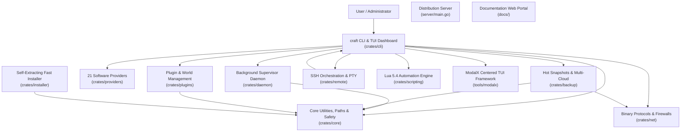

# Comprehensive Project Analysis: Craft Workspace

> **Repository**: `larvance/craft`  
> **Workspace Model**: Multi-crate Rust Workspace CLI & Background Supervisor Daemon, Standalone Fast Installer, Go Distribution Server, and Documentation Portals  
> **Primary Language**: Rust (2021 Edition, MSRV 1.80+)  
> **Codebase Scale**: ~32,000+ Rust lines across 11 workspace crates (plus Go, React 18, VitePress, and Shell tooling)  
> **Current Version**: `v1.0.0`

---

## 1. Executive Overview

**Craft** is a modular, high-performance server management suite, background supervisor daemon, interactive terminal user interface (TUI) powered by ModalX, and remote orchestration engine designed for Minecraft and dedicated game servers. It bridges the gap between simple command-line wrappers and complex multi-server panels (such as Pterodactyl or AMP), packing full server lifecycle orchestration into a single native binary (<15 MB) with sub-millisecond startup times and a minimal memory footprint (<10 MB RSS for the daemon supervisor).

Craft provides end-to-end server lifecycle management across **21 server platforms** spanning Java Edition, Bedrock Edition, Proxies, and Native Game Engines (Factorio, Terraria, Palworld, Valheim, and Custom Lua/Binary engines). It features typed IPC background supervision, atomic zero-downtime hot backups, cross-platform remote orchestration over SSH, native binary protocol diagnostics (SLP, RakNet, A2S_INFO, RCON), multi-repository plugin/mod management, Zstandard-compressed caching, and an interactive TUI dashboard driven by ModalX.

---

## 2. Workspace Crate Composition and Topology

The Craft ecosystem is organized into 11 specialized Rust crates, a Go binary service, and web documentation portals:

| Layer / Crate | Path | Primary Role and Capabilities |
| :--- | :--- | :--- |
| **`craft-core`** | [`crates/core/`](../crates/core) | Filesystem isolation (`CraftPaths`), process locking (`server.lock`), dynamic Java discovery, bytecode inspection (`0xCAFEBABE`), LRU zstd artifact cache, non-destructive `TrashManager` (files & dirs), dynamic memory optimizer (`MemoryOptimizer`), multi-tenant role-based access control (`RbacRegistry`, `Role`, `Permission`, `UserAccount`), cryptographic append-only audit ledger (`AuditLedger`, HMAC-SHA256 hash chaining), transactional registries (`ServersRegistry`, `AutoscaleRegistry`, `RemotesRegistry`, `GlobalBackupRegistry`, `ClustersRegistry`, `WebhooksRegistry`), properties parsing. |
| **`craft-providers`** | [`crates/providers/`](../crates/providers) | 21 server platforms across Java, Bedrock, Proxies, and Native games. Dynamic software provider loader (`craft.custom.toml`), asset resolution, automated GC tuning profiles (`--aikar`, `--zgc`, `--shenandoah`), in-memory embedded fallback catalogs. |
| **`craft-daemon`** | [`crates/daemon/`](../crates/daemon) | Detached background supervisor process, typed IPC over Unix sockets (`daemon.sock`) and Named Pipes (`\\.\pipe\craft-daemon`), 50k-line circular log ring buffer, stdin command injection, OS service unit generation, Prometheus `/metrics` exposition, event-driven webhooks (`Discord`, `Slack`, `GenericJson`), authenticated WebSocket console gateway, embedded zero-dependency Web Dashboard SPA (`DASHBOARD_HTML`) & REST API (`/api/auth`, `/api/servers`, `/api/audit`, `/api/rbac`), background storage monitor, and idle hibernation manager (`HibernationManager`) with packet-triggered wake triggers. |
| **`craft-net`** | [`crates/net/`](../crates/net) | Pure Rust networking protocols: Java SLP (TCP VarInt handshake), Bedrock RakNet (UDP 0x01), Valve A2S_INFO query, async RCON client, pure-Rust TCP `SleepProxy` (sleeping MOTD, login packet wake), host firewall automation (iptables, UFW, netsh, pfctl), Windows UWP loopback exemption. |
| **`craft-plugins`** | [`crates/plugins/`](../crates/plugins) | Unified plugin and mod search across Modrinth, Hangar, and Poggit; universal modpack distribution engine (`modpack`) for Modrinth `.mrpack` and CurseForge server packs with SHA-512 verification and zstd caching; in-memory bytecode JAR manifest extraction (Bukkit, Fabric, Quilt, NeoForge/Forge, Velocity, Bungee); semantic compatibility verification; recursive dependency resolution; SHA-512 update checker with atomic upgrades and rollback protection; universal community map resolver; NBT player data inspection, dimension management. |
| **`craft-backup`** | [`crates/backup/`](../crates/backup) | Zero-downtime RCON-synchronized hot backups, atomic tar.gz / tar.zst archiving, selective world backups (`--world-only`), local retention enforcement, AWS S3 SigV4 HMAC-SHA256, Google Drive OAuth2 REST integration, restore lock safety. |
| **`craft-remote`** | [`crates/remote/`](../crates/remote) | Multi-node SSH connection pooling, SFTP bidirectional synchronization, interactive remote PTY proxy, tri-platform remote host bootstrapping (Linux, macOS, Windows). |
| **`craft-scripting`** | [`crates/scripting/`](../crates/scripting) | Embedded Lua 5.4 engine (`mlua`) with sandboxed execution, `craft.*` stdlib (fs, servers, http, properties, exec), declarative software package format, starter script generators. |
| **`modalx`** | [`tools/modalx/`](../tools/modalx) | Standalone centered TUI modal framework, bounded box frames with display column width calculations (`unicode-width`), `TextInput` readline engine, navigation guards, zero-emoji aesthetic. |
| **`craft-cli`** | [`crates/cli/`](../crates/cli) | Main CLI entrypoint, 36 command handlers including `user`, `audit`, `optimize`, `modpack`, `autoscale`, `hibernate`, full-screen interactive TUI dashboard, virtual scrolling console with 16 KB chunked seek reader and inside-the-box anchored command prompt. |
| **`craft-installer`** | [`crates/installer/`](../crates/installer) | Ultra-fast standalone self-extracting installer (<35ms install time) with embedded zstd decompression and PATH configuration. |
| **Distribution Server** | [`server/`](../server) | Concurrent Go HTTP server with SHA-256 caching and dynamic install script templating (`install.sh`, `install.ps1`). |
| **Documentation Portals**| [`docs/`](../docs) | React 18 / Vite 6 portal and VitePress documentation suite in `tools/modalx/docs/`. |

---

## 3. Specialized Domain Skill Modules

To maintain deep technical excellence without cluttering high-level documentation, specialized domain knowledge is maintained within individual skill modules under `analysis/`. Each module contains a comprehensive `SKILL.md` detailing implementation rules, algorithms, data contracts, and operational guidelines:

1. **Architecture & Core Mechanics**: [`analysis/architecture/SKILL.md`](./architecture/SKILL.md)  
   Crate dependency boundaries, transactional registry serialization, inter-process locking, path resolution, and error handling architecture.
2. **Daemon & Background Supervision**: [`analysis/daemon-supervision/SKILL.md`](./daemon-supervision/SKILL.md)  
   IPC protocols, circular ring buffer management, stdin streaming, service unit templating, detached process supervision.
3. **Protocols & Networking Security**: [`analysis/protocols-networking/SKILL.md`](./protocols-networking/SKILL.md)  
   VarInt framing, RakNet packet decoding, Valve A2S_INFO query, async RCON client, and programmatic OS firewall provisioning.
4. **Backup Systems & Resilience**: [`analysis/backup-resilience/SKILL.md`](./backup-resilience/SKILL.md)  
   RCON-synchronized save flushes, atomic compression, S3 Signature Version 4 HMAC, Google Drive integration, and restore concurrency guards.
5. **Software Providers & Multi-Engine Parity**: [`analysis/software-providers/SKILL.md`](./software-providers/SKILL.md)  
   21 server engine specifications, dynamic TOML definition packages, bytecode inspection, GC profiles, and multi-game support.
6. **UI/UX & Terminal Modals (ModalX)**: [`analysis/uiux-tui/SKILL.md`](./uiux-tui/SKILL.md)  
   Centered bounded box rendering, `unicode-width` border alignment, readline `TextInput` keybindings, and virtual seek-based log streaming.
7. **Security, Diagnostics & Data Safety**: [`analysis/security-safety/SKILL.md`](./security-safety/SKILL.md)  
   Process lock guards, non-destructive `TrashManager` (files and directories), diagnostic self-healing (`craft fix`), and EULA enforcement.

---

## 4. Multi-Repository Assessment

- **Current Repository Model**: Craft operates as a unified Cargo workspace containing 11 crates.
- **Standalone Evaluation**:
  - `tools/modalx` is already decoupled into its own standalone Git repository (`git@github.com:larvance/modalx.git`) and published separately to crates.io (`modalx = "0.1.3"`), while remaining synchronized in the workspace for atomic co-development.
  - All other crates (`craft-core`, `craft-providers`, `craft-daemon`, `craft-net`, `craft-plugins`, `craft-backup`, `craft-remote`, `craft-scripting`, `craft-installer`, `craft-cli`) share deep domain interdependencies and benefits from the mono-workspace model.
  - Splitting the remaining crates into separate repositories is **not recommended** at this time, as single-workspace atomic builds guarantee ABI parity and prevent dependency drift.
